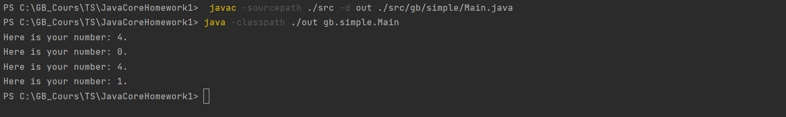
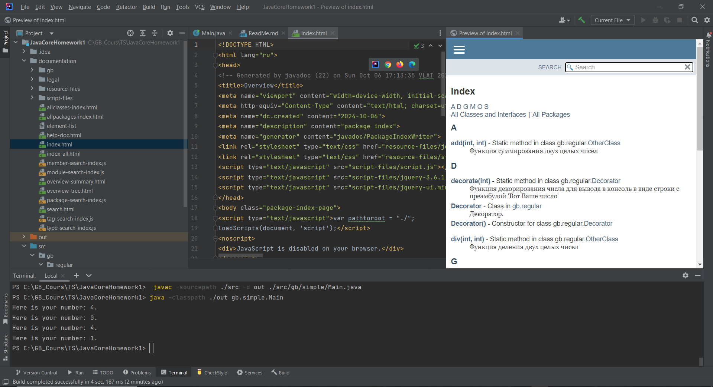

# Урок 2. Семинар: Компиляция и интерпретация кода

Задание:
Создать docker-контейнер для формирования полной документации по проекту.

-------------------------------------------------------

Команды:

    javac -sourcepath ./src -d out ./src/gb/simple/Main.java
    java -classpath ./out gb.simple.Main
    javadoc -d documentation -sourcepath src -cp .\out\ -subpackages gb

Демонстрация решения:

